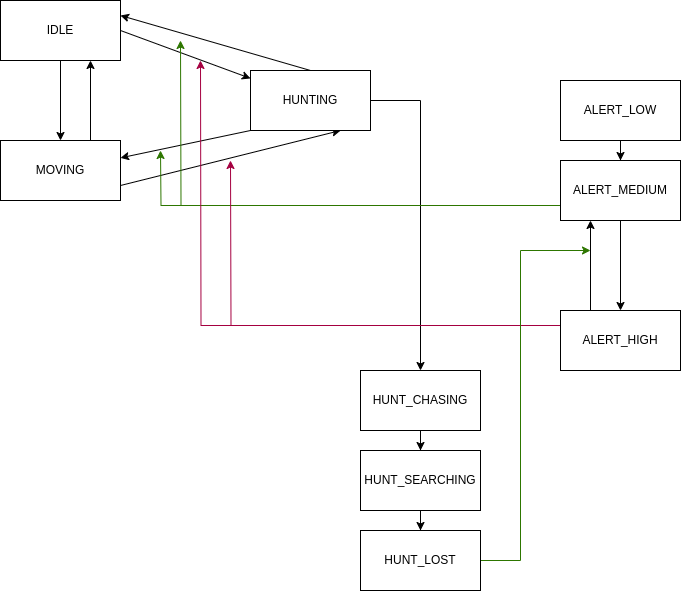

# Game Jam: Getting Started

This godot project contains a collection of ideas that I wanted to try.

- Recording and replaying movement of the player on demand.
- Dynamic tilemap generation from images.
- Enemy state management for ALERTNESS and HUNTING actions.

## Developer requirements
- Godot v4.1

## Project overview
The project is broken into three folders: assets, components, scenes.

Components
1. Distraction
2. Enemy
3. Map generator
4. Player
5. Surface

## Enemy

The enemy has three states: idle, moving, and hunting. The enemy scene was designed so that the enemy class is responsible for state management, and the `action_move.gd` and `action_hunt.gd` classes handle logic specific to each action type.



## Player


The player class is designed to work with any class that implements some of the interface of the built-in `Input` class.

1. When the player is in `PLAY` mode, the class will record the state changes of Godot input events and the time when they happened. The input events are logged with the `ActionEventLog.gd` class.
2. When the player presses the key linked to the start fresh input event (`'`) the player is reset to their original position and a clone is made with their mode set to `REPLAY`.
3. During the cloning process the original player class sets the input source of the clone to `InputMock` and sends a copy of the events in `ActionEventLog` to the clone.
4. `ReplayActionEventLog.gd` reads the events and replays them at the correct time using the linked timestamps.

## Map generator


This is the simplest implementation of the project.

The class uses the `@tool` attribute which allows the script to run in the editor and at runtime.

The class accepts any image Godot supports, and for every black pixel adds a tile to a tilemap.

```python
	self.clear()
	var w = mapTexture.get_width()
	var h = mapTexture.get_height()

	var data = mapTexture.get_image()

	for x in range(w):
		for y in range(h):
			if data.get_pixel(x, y) == Color.BLACK:
				self.set_cell(0, Vector2(x, y), 0, Vector2(0, 0))

```

To improve the development experience this class uses a setter on the exported mapTexture variable so that changes to the image can be processed immediately:

```python
var _texture: CompressedTexture2D
@export var mapTexture: CompressedTexture2D:
	set(val):
		_texture = val
		# Update the map when it is updated
		createMap()
		pass
	get:
		return _texture
```